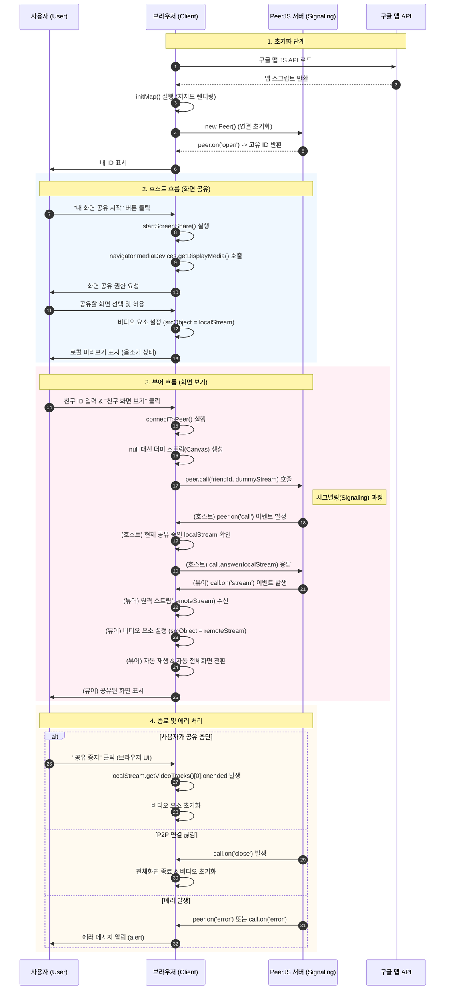

# 화면 공유 실행 흐름도

이 문서는 P2P 화면 공유 애플리케이션의 초기화, 호스트(공유자) 신호 처리, 뷰어(시청자) 신호 처리 및 에러 처리 과정을 상세히 설명합니다.

```mermaid
sequenceDiagram
    autonumber
    
    participant User as 사용자 (User)
    participant Browser as 브라우저 (Client)
    participant PeerJS as PeerJS 서버 (Signaling)
    participant Google as 구글 맵 API

    Note over Browser, Google: 1. 초기화 단계
    Browser->>Google: 구글 맵 JS API 로드
    Google-->>Browser: 맵 스크립트 반환
    Browser->>Browser: initMap() 실행 (지지도 렌더링)
    Browser->>PeerJS: new Peer() (연결 초기화)
    PeerJS-->>Browser: peer.on('open') -> 고유 ID 반환
    Browser->>User: 내 ID 표시

    rect rgb(240, 248, 255)
        Note over User, PeerJS: 2. 호스트 흐름 (화면 공유)
        User->>Browser: "내 화면 공유 시작" 버튼 클릭
        Browser->>Browser: startScreenShare() 실행
        Browser->>Browser: navigator.mediaDevices.getDisplayMedia() 호출
        Browser->>User: 화면 공유 권한 요청
        User->>Browser: 공유할 화면 선택 및 허용
        Browser->>Browser: 비디오 요소 설정 (srcObject = localStream)
        Browser->>User: 로컬 미리보기 표시 (음소거 상태)
    end

    rect rgb(255, 240, 245)
        Note over User, PeerJS: 3. 뷰어 흐름 (화면 보기)
        User->>Browser: 친구 ID 입력 & "친구 화면 보기" 클릭
        Browser->>Browser: connectToPeer() 실행
        Browser->>Browser: null 대신 더미 스트림(Canvas) 생성
        Browser->>PeerJS: peer.call(friendId, dummyStream) 호출
        
        Note right of PeerJS: 시그널링(Signaling) 과정
        PeerJS->>Browser: (호스트) peer.on('call') 이벤트 발생
        Browser->>Browser: (호스트) 현재 공유 중인 localStream 확인
        Browser->>PeerJS: (호스트) call.answer(localStream) 응답
        
        PeerJS->>Browser: (뷰어) call.on('stream') 이벤트 발생
        Browser->>Browser: (뷰어) 원격 스트림(remoteStream) 수신
        Browser->>Browser: (뷰어) 비디오 요소 설정 (srcObject = remoteStream)
        Browser->>Browser: (뷰어) 자동 재생 & 자동 전체화면 전환
        Browser->>User: (뷰어) 공유된 화면 표시
    end

    rect rgb(255, 250, 240)
        Note over User, PeerJS: 4. 종료 및 에러 처리
        
        alt 사용자가 공유 중단
            User->>Browser: "공유 중지" 클릭 (브라우저 UI)
            Browser->>Browser: localStream.getVideoTracks()[0].onended 발생
            Browser->>Browser: 비디오 요소 초기화
        else P2P 연결 끊김
            PeerJS->>Browser: call.on('close') 발생
            Browser->>Browser: 전체화면 종료 & 비디오 초기화
        else 에러 발생
            PeerJS->>Browser: peer.on('error') 또는 call.on('error')
            Browser->>User: 에러 메시지 알림 (alert)
        end
    end
```
