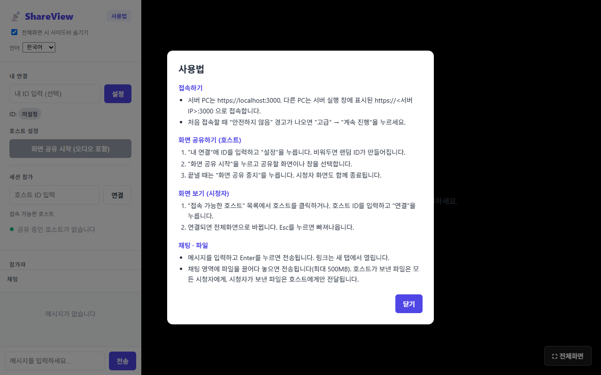
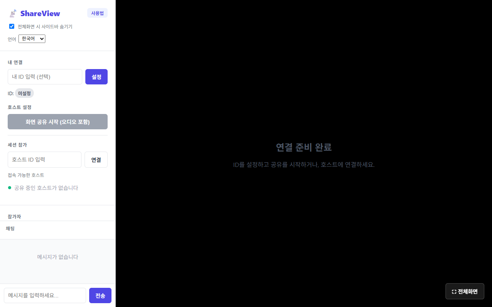
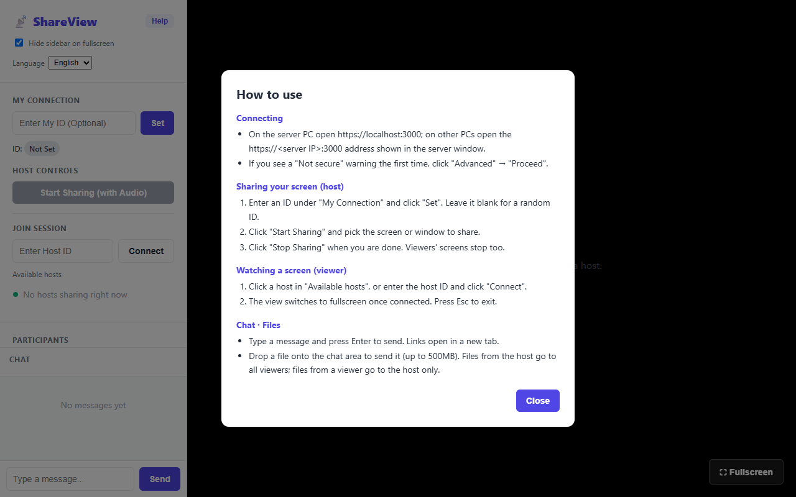

# 사용법 모달 추가

**작성일**: 2026-09-15

## 개요
처음 접속한 사용자가 접속 방법, 호스트·시청자 사용 순서, 채팅·파일 기능을 한 화면에서 볼 수 있도록 사용법 모달을 추가했습니다.
HTTPS 전환 이후 "인증서 경고 → 고급 → 계속 진행" 단계가 생겼고, 호스트와 시청자의 사용 순서가 처음 보는 사람에게는 잘 드러나지 않아 안내가 필요했습니다.

- **첫 방문 시 자동 표시**: 한 번 표시되면 다시 자동으로 뜨지 않습니다.
- **다시 열기**: 사이드바 상단의 **사용법**(영어: Help) 버튼으로 언제든 열 수 있습니다.
- **닫기**: "닫기" 버튼 또는 Esc 키로 닫습니다.
- **다국어**: 한국어/영어 전환을 따릅니다.

## 스크린샷

### 1. 첫 방문 — 사용법 모달 자동 표시 (한국어)

### 2. 모달을 닫은 뒤 — 사이드바 상단의 "사용법" 버튼

### 3. 영어로 전환 후 "Help" 버튼으로 연 화면

## 변경 사항

### 1. UI (`index.html`)
- 로고 옆에 **사용법** 버튼 추가 (`.help-btn`).
- 브라우저 기본 `<dialog>` 요소로 모달 구성 — 별도 라이브러리 없음. 배경 어둡게 처리(`::backdrop`), Esc 닫기, 포커스 가두기는 브라우저가 기본 제공합니다.
- 닫기 버튼은 `<form method="dialog">`로 구현해 JS 없이 닫힙니다.
- 참가자 목록용 전역 `li` 스타일(초록 점, 흰 배경)이 모달 목록에 적용되지 않도록 `#help-dialog li`에서 해제했습니다.

### 2. 로직 (`screenShare.js`)
- 페이지 로드 시 `localStorage`의 `helpSeen` 값이 없으면 모달을 자동으로 열고 값을 저장합니다.

### 3. 다국어 (`i18n.js`)
- 모달 제목·소제목·안내 문구 16개 키를 한국어/영어로 추가했습니다 (`helpBtn`, `helpTitle`, `helpConnect1` 등).

## 모달 내용

| 구분 | 안내 내용 |
|------|-----------|
| 접속하기 | 서버 PC는 `https://localhost:3000`, 다른 PC는 서버 실행 창에 표시된 `https://<서버 IP>:3000`. 인증서 경고 시 "고급" → "계속 진행" |
| 화면 공유하기 (호스트) | ID 입력 후 "설정"(비우면 랜덤 ID) → "화면 공유 시작" → 끝낼 때 "화면 공유 중지" |
| 화면 보기 (시청자) | "접속 가능한 호스트"에서 클릭 또는 ID 입력 후 "연결" → 전체화면 전환, Esc로 나가기 |
| 채팅 · 파일 | Enter로 전송, 링크는 새 탭. 파일은 채팅 영역에 끌어다 놓기(최대 500MB) |

## 검증 결과
실제 HTTPS 서버(`https://localhost:3000`)를 헤드리스 Edge로 열어 확인했습니다. 새 브라우저 프로필을 사용해 "첫 방문" 상태를 그대로 재현했습니다.

| 항목 | 기대 결과 | 결과 |
|------|-----------|------|
| 첫 방문 | 모달 자동 표시, 한국어 | ✅ |
| "닫기" 버튼 | 모달 닫힘 | ✅ |
| 재방문(새로고침) | 모달이 자동으로 뜨지 않음 | ✅ |
| 언어를 English로 변경 후 "Help" 버튼 | 영어 모달 표시 (제목 "How to use") | ✅ |
| Esc 키 | 모달 닫힘 | ✅ |
| 서버 통합 테스트 (`npm test`) | 기존 5개 테스트 통과 | ✅ 5/5 |

## 주의 사항
- **파일 전달 범위**: 호스트가 보낸 파일은 모든 시청자에게 가지만, **시청자가 보낸 파일은 호스트에게만** 전달됩니다(채팅과 달리 다른 시청자에게 중계하지 않음). 모달에는 현재 동작대로 안내했습니다. 기존 [드래그 앤 드롭 보고서](patch_feature_drag_drop.md)에는 "호스트가 다시 브로드캐스트"한다고 적혀 있으나 실제 코드와 다릅니다.
- **첫 방문 판단**: 브라우저별 `localStorage` 기준이므로, 다른 브라우저나 시크릿 창에서는 다시 자동으로 표시됩니다.
